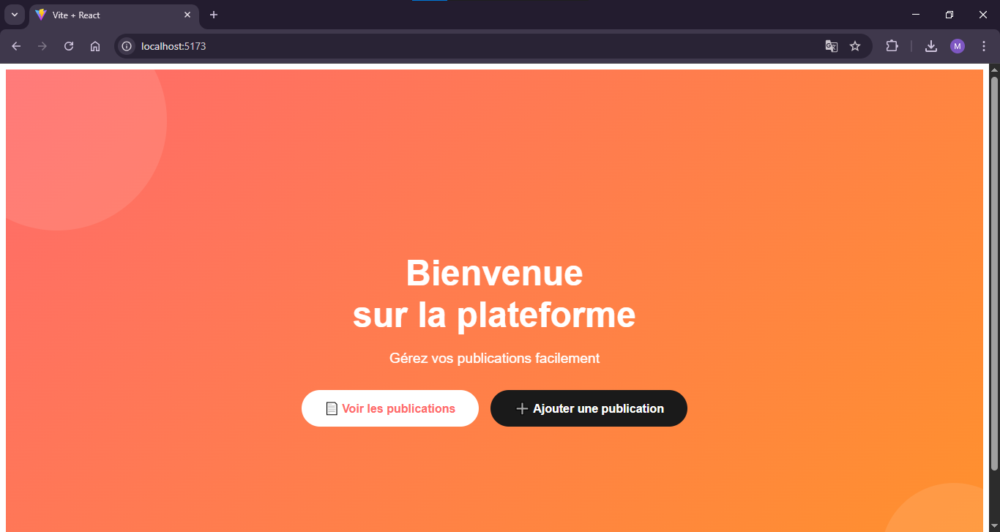
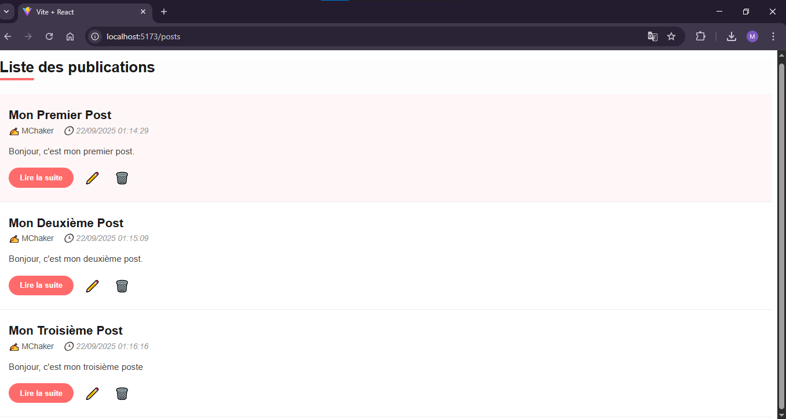
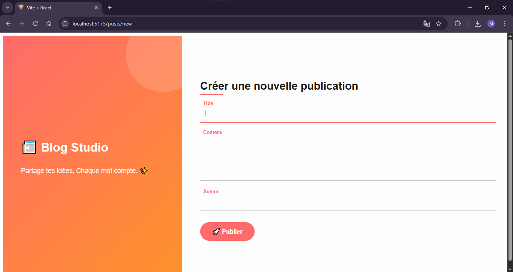
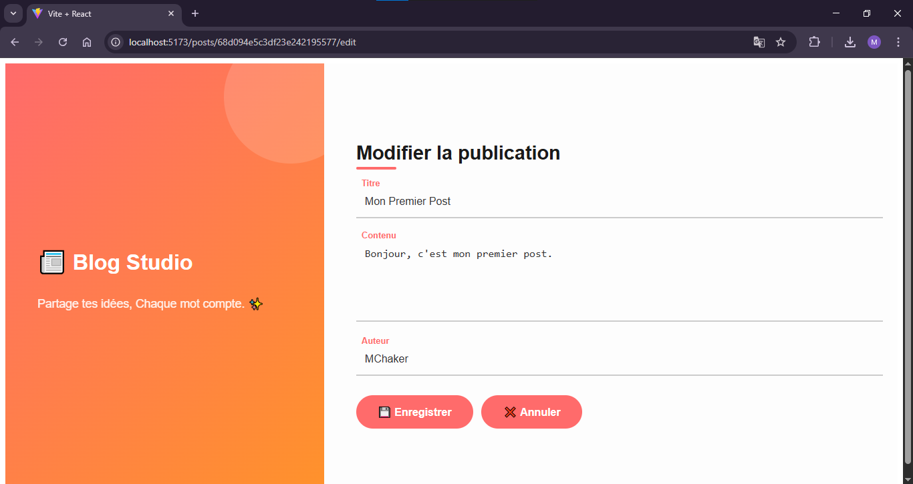

# 📝 Créateur de Publications de Blog Simple (MERN Stack)

## Description du Projet

Ce projet est une application web complète (Full-Stack) développée avec la stack MERN (MongoDB, Express.js, React, Node.js) permettant de créer, lire, modifier et supprimer (CRUD) des publications de blog. Il sert de démonstration des compétences fondamentales en développement web Full-Stack, avec une API REST robuste et une interface utilisateur interactive.

## Fonctionnalités

*   **Création de Publications :** Les utilisateurs peuvent ajouter de nouvelles publications de blog avec un titre, un contenu et un auteur via un formulaire dédié.
*   **Lecture de Publications :**
    *   Affichage d'une liste de toutes les publications de blog existantes.
    *   Chaque publication affiche son titre, son contenu, son auteur et sa date de publication.
    *   La liste se met à jour dynamiquement après chaque ajout ou suppression.
*   **Modification de Publications :** Possibilité de modifier une publication existante via un formulaire pré-rempli avec les données actuelles de la publication.
*   **Suppression de Publications :** Les utilisateurs peuvent supprimer une publication de la liste.
*   **Navigation Fluide :** Utilisation de React Router DOM pour une navigation client-side entre la page d'accueil, la liste des publications, le formulaire de création et le formulaire d'édition sans rechargement complet de la page.
*   **Validation côté serveur :** L'API s'assure que les données reçues sont valides avant l'enregistrement.
*   **Gestion des erreurs :** Affichage de messages d'erreur et de succès pertinents pour l'utilisateur.

## Technologies Utilisées

### Frontend
*   **React.js :** Bibliothèque JavaScript pour la construction de l'interface utilisateur.
*   **Vite :** Outil de build rapide pour les projets frontend.
*   **React Router DOM :** Pour la gestion du routing et de la navigation côté client.
*   **CSS :** Pour le stylisme de l'application.

### Backend
*   **Node.js :** Environnement d'exécution JavaScript côté serveur.
*   **Express.js :** Framework web pour Node.js utilisé pour construire l'API REST.
*   **Mongoose :** Bibliothèque de modélisation d'objets (ODM) pour MongoDB, facilitant les interactions avec la base de données.
*   **Dotenv :** Pour la gestion sécurisée des variables d'environnement.
*   **CORS :** Middleware Express pour autoriser les requêtes cross-origin du frontend.

### Base de Données
*   **MongoDB :** Base de données NoSQL flexible et orientée documents.

### Outils de Développement
*   **Git :** Système de contrôle de version.
*   **GitHub :** Plateforme d'hébergement de dépôts Git.
*   **Postman :** Pour le test et la validation des endpoints de l'API REST.

## Structure du Projet

Le projet est organisé en deux sous-dossiers principaux, chacun étant une application distincte :

```bash
blog_app/
├── blog_backend/         # Contient l'API RESTful développée avec Node.js, Express et Mongoose.
│   ├── models/           # Définitions des schémas Mongoose.
│   ├── .env              # Variables d'environnement (ignoré par Git).
│   └── index.js          # Point d'entrée du serveur backend.
├── blog_frontend/        # Contient l'application cliente développée avec React et Vite.
│   ├── src/              # Code source des composants React, CSS, etc.
│   ├── public/           # Fichiers statiques.
│   └── index.html        # Page HTML principale du frontend.
├── .gitignore            # Fichier .gitignore global pour le projet parent.
└── README.md             # Ce fichier de documentation.
```


## Mise en Place et Exécution (Localement)

Suivez ces instructions pour installer et exécuter l'application sur votre machine locale.

### Prérequis

*   [Node.js](https://nodejs.org/) et [npm](https://www.npmjs.com/) (Node Package Manager) installés.
*   [MongoDB](https://www.mongodb.com/try/download/community) installé et en cours d'exécution localement, ou une instance MongoDB Atlas configurée.

### 1. Clonage du Dépôt

Ouvrez votre terminal et clonez le dépôt GitHub :

```bash
git clone https://github.com/MChaker01/blog_mern_app.git
cd [Nom de votre dépôt] # Par exemple, cd blog-mern
```

### 2. Configuration et Lancement du Backend

```bash 
cd blog_backend
npm install # Installe toutes les dépendances du backend
```

Créez un fichier .env à la racine du dossier blog_backend avec le contenu suivant :

```bash 
PORT=3000
DB_URI=mongodb://localhost:27017/blog_app_db
```
(Remplacez mongodb://localhost:27017/blog_app_db par votre URI MongoDB Atlas si vous utilisez une base de données cloud.)

Lancez le serveur backend :

```bash
node index.js
```

Le serveur devrait démarrer et être accessible sur http://localhost:3000.

### 3. Configuration et Lancement du Frontend

Ouvrez un nouveau terminal et naviguez vers le dossier du frontend :

```bash
cd ../blog_frontend # Retourne au dossier parent, puis entre dans blog_frontend
npm install # Installe toutes les dépendances du frontend
```

Lancez l'application frontend en mode développement :

```bash
npm run dev
```

Le frontend devrait démarrer et être accessible via votre navigateur, généralement sur http://localhost:5173.

### Accès à l'Application

Une fois les deux serveurs (backend et frontend) en cours d'exécution, ouvrez votre navigateur et accédez à l'URL du frontend :

http://localhost:5173

## Captures d'Écran

### Page d'Accueil


### Liste des Publications


### Formulaire de Création


### Formulaire d'Édition

